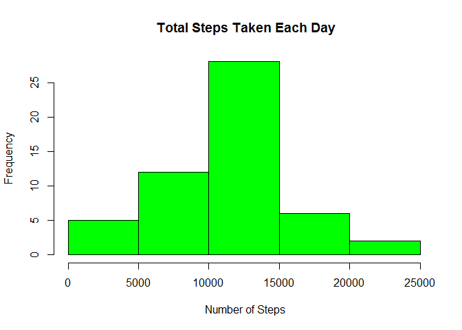
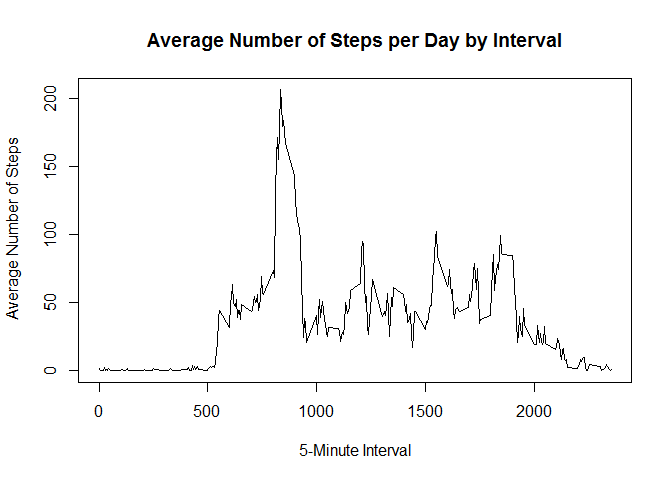
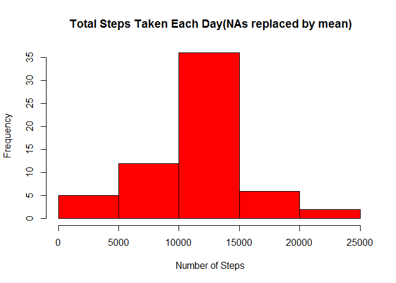
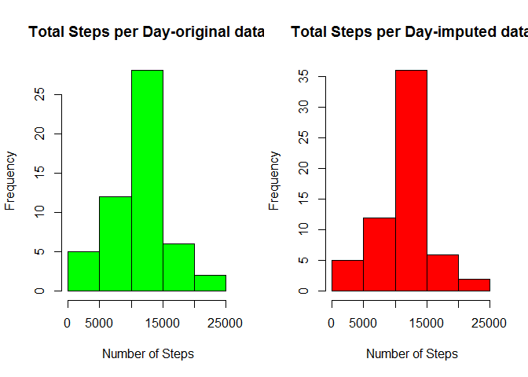
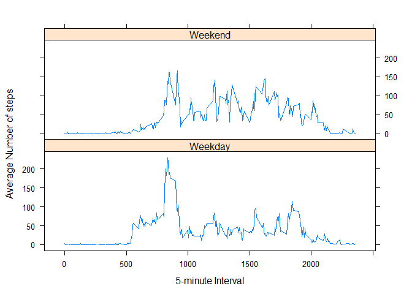

# Reproducible Research: Peer Assessment 1


## Loading and preprocessing the data

### read activity.csv data

```r
path2activitydata <- file.path(getwd(),"activity.csv") 
activityData <- read.csv(path2activitydata) 
str(activityData)
```

```
## 'data.frame':	17568 obs. of  3 variables:
##  $ steps   : int  NA NA NA NA NA NA NA NA NA NA ...
##  $ date    : Factor w/ 61 levels "2012-10-01","2012-10-02",..: 1 1 1 1 1 1 1 1 1 1 ...
##  $ interval: int  0 5 10 15 20 25 30 35 40 45 ...
```

## What is mean total number of steps taken per day?

### 1. Calculate total number of steps taken per day

```r
totalSteps_perDay <- aggregate(steps ~ date, activityData, sum)
head(totalSteps_perDay)
```

```
##         date steps
## 1 2012-10-02   126
## 2 2012-10-03 11352
## 3 2012-10-04 12116
## 4 2012-10-05 13294
## 5 2012-10-06 15420
## 6 2012-10-07 11015
```

### 2. Make a histogram of the total number of steps taken per day

```r
hist(totalSteps_perDay$steps,col="green", main = " Total Steps Taken Each Day", 
     xlab = " Number of Steps" )
```

 

### 3. Calculate and report the mean and median of the total number of steps taken per day


```r
mean_totalSteps <- mean(totalSteps_perDay$steps) 
mean_totalSteps
```

```
## [1] 10766.19
```

```r
median_totalSteps <- median(totalSteps_perDay$steps) 
median_totalSteps
```

```
## [1] 10765
```


## What is the average daily activity pattern?

### 1. Make a time series plot(i.e type = "l") of the 5-minute interval (x-axis) and the average number of steps taken, averaged across all days(y-axis)

#### calculate average steps taken averaged across all days

```r
avgSteps_perInterval <- aggregate(steps ~ interval, activityData, mean)
head(avgSteps_perInterval)
```

```
##   interval     steps
## 1        0 1.7169811
## 2        5 0.3396226
## 3       10 0.1320755
## 4       15 0.1509434
## 5       20 0.0754717
## 6       25 2.0943396
```

```r
tail(avgSteps_perInterval)
```

```
##     interval     steps
## 283     2330 2.6037736
## 284     2335 4.6981132
## 285     2340 3.3018868
## 286     2345 0.6415094
## 287     2350 0.2264151
## 288     2355 1.0754717
```

#### time series plot of the 5-minute interval vs average steps per interval

```r
plot(avgSteps_perInterval$interval,avgSteps_perInterval$steps, 
     type="l", 
     xlab="5-Minute Interval", ylab=" Average Number of Steps",
     main="Average Number of Steps per Day by Interval")
```

 

### 2. Which 5-minute interval, on average across all the days in the dataset, contains the maximum number of steps ?

```r
max_avgStepsPerInterval <- avgSteps_perInterval[which.max(avgSteps_perInterval$steps),1]

max_avgStepsPerInterval 
```

```
## [1] 835
```

```r
max(avgSteps_perInterval$steps) 
```

```
## [1] 206.1698
```


## Imputing missing values

### 1. Calculate the total number of missing values in the dataset

```r
activityData_NAs <- sum(is.na(activityData))
activityData_NAs
```

```
## [1] 2304
```

### 2. Replace the missing values (NAs) with mean for that 5-minute interval and create a new dataset with NAs filled in

```r
imputed_activityData <- transform(activityData, 
                          steps = ifelse(is.na(activityData$steps), 
                                    avgSteps_perInterval$steps[match(activityData$interval, avgSteps_perInterval$interval)], activityData$steps))

str(imputed_activityData) 
```

```
## 'data.frame':	17568 obs. of  3 variables:
##  $ steps   : num  1.717 0.3396 0.1321 0.1509 0.0755 ...
##  $ date    : Factor w/ 61 levels "2012-10-01","2012-10-02",..: 1 1 1 1 1 1 1 1 1 1 ...
##  $ interval: int  0 5 10 15 20 25 30 35 40 45 ...
```


### 3. Calculate total number of steps taken per day in the imputed activity dataset

```r
totalSteps_perDay_new <- aggregate(steps ~ date, imputed_activityData, sum)
head(totalSteps_perDay_new)
```

```
##         date    steps
## 1 2012-10-01 10766.19
## 2 2012-10-02   126.00
## 3 2012-10-03 11352.00
## 4 2012-10-04 12116.00
## 5 2012-10-05 13294.00
## 6 2012-10-06 15420.00
```

```r
### 4. Make a histogram of the total number of steps taken per day in the imputed dataset

hist(totalSteps_perDay_new$steps,col="red", main = " Total Steps Taken Each Day(NAs replaced by mean)", 
     xlab = " Number of Steps" )
```

 

### 5. Calculate and report the new mean and median of the total number of steps taken per day

```r
#### Calculate new Mean
mean_totalSteps_new <- mean(totalSteps_perDay_new$steps) 

#### Report new mean of the total number of steps taken per day
mean_totalSteps_new
```

```
## [1] 10766.19
```

```r
#### Calculate new Median
median_totalSteps_new <- median(totalSteps_perDay_new$steps) 

#### Report new median of the total number of steps taken per day
median_totalSteps_new
```

```
## [1] 10766.19
```


#### Create Histogram to show difference. 

```r
par(mfrow=c(1,2))
hist(totalSteps_perDay$steps,col="green", main = "Total Steps per Day-original data", 
     xlab = " Number of Steps" )
hist(totalSteps_perDay_new$steps,col="red", main = "Total Steps per Day-imputed data", 
     xlab = " Number of Steps" )
```

 


#### What is the impact of imputing missing data on the estimates of the toal daily number of steps?

```r
diff <- matrix(c(mean_totalSteps, median_totalSteps, mean_totalSteps_new, median_totalSteps_new),
       nrow = 2, ncol = 2, byrow = TRUE)

colnames(diff) <- c("Mean", "Median")
rownames(diff) <- c("Activitiy","Imputed_Activity")

diff
```

```
##                      Mean   Median
## Activitiy        10766.19 10765.00
## Imputed_Activity 10766.19 10766.19
```


## Are there differences in activity patterns between weekdays and weekends?

### Create a new factor variable in the imputed date set with two levels - "Weekday" and "weekend"

```r
imputed_activityData$date <- as.Date(imputed_activityData$date, "%Y-%m-%d") # convert date type from factor to date

days <- weekdays(imputed_activityData$date) # identify the weekdays from the date variable

head(days)
```

```
## [1] "Monday" "Monday" "Monday" "Monday" "Monday" "Monday"
```

```r
#### create a new variable to indicate weekday and weekend
dayType <- vector() 

for(i in 1:nrow(imputed_activityData))
    {
        if (days[i] == "Saturday"){
                dayType[i] <- "Weekend" }
        else if (days[i] == "Sunday"){
                dayType[i] <- "Weekend" }
        else {
                dayType[i] <- "Weekday" }
        
   }

imputed_activityData$dayType <- dayType

imputed_activityData$dayType  <- factor(imputed_activityData$dayType ) # convert the vector type to factor

str(imputed_activityData)
```

```
## 'data.frame':	17568 obs. of  4 variables:
##  $ steps   : num  1.717 0.3396 0.1321 0.1509 0.0755 ...
##  $ date    : Date, format: "2012-10-01" "2012-10-01" ...
##  $ interval: int  0 5 10 15 20 25 30 35 40 45 ...
##  $ dayType : Factor w/ 2 levels "Weekday","Weekend": 1 1 1 1 1 1 1 1 1 1 ...
```


### Make a time series plot(i.e type = "l") of the 5-minute interval (x-axis) and the average number of steps taken, averaged across all weekdays or weekends(y-axis)

#### calculate average steps taken averaged across all days

```r
avgSteps_perDayType <- aggregate(steps ~ interval+dayType, imputed_activityData, mean)

head(avgSteps_perDayType)
```

```
##   interval dayType      steps
## 1        0 Weekday 2.25115304
## 2        5 Weekday 0.44528302
## 3       10 Weekday 0.17316562
## 4       15 Weekday 0.19790356
## 5       20 Weekday 0.09895178
## 6       25 Weekday 1.59035639
```

```r
tail(avgSteps_perDayType)
```

```
##     interval dayType       steps
## 571     2330 Weekend  1.38797170
## 572     2335 Weekend 11.58726415
## 573     2340 Weekend  6.28773585
## 574     2345 Weekend  1.70518868
## 575     2350 Weekend  0.02830189
## 576     2355 Weekend  0.13443396
```

```r
#### time series plot of the 5-minute interval vs average steps per weekdays or weekends

library(lattice)

xyplot(steps ~ interval | dayType, avgSteps_perDayType, type = "l", layout = c(1, 2), 
       xlab = "5-minute Interval", ylab = " Average Number of steps")
```

 


